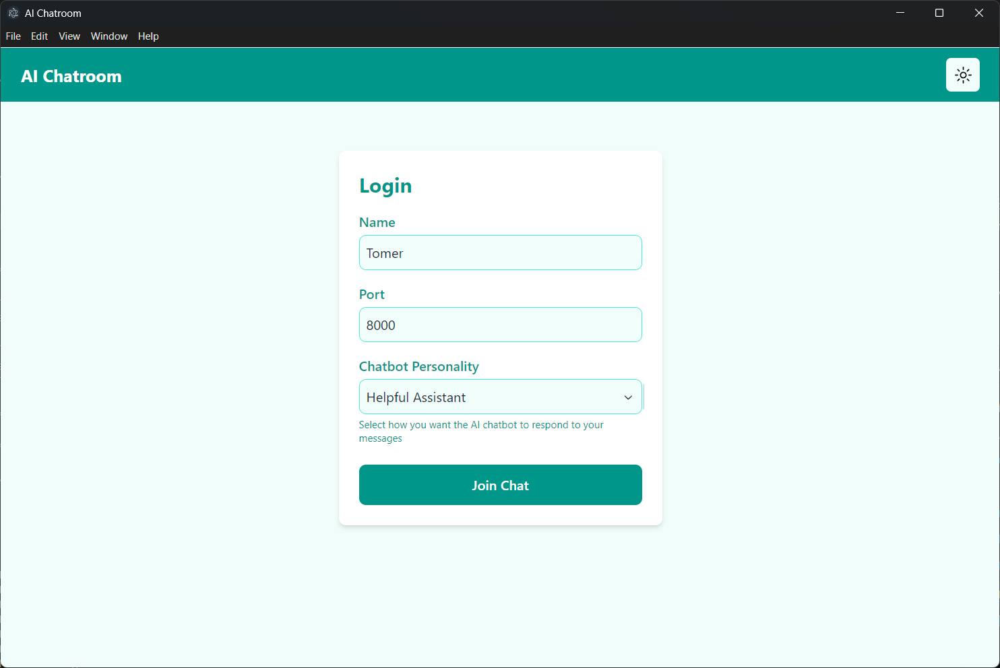
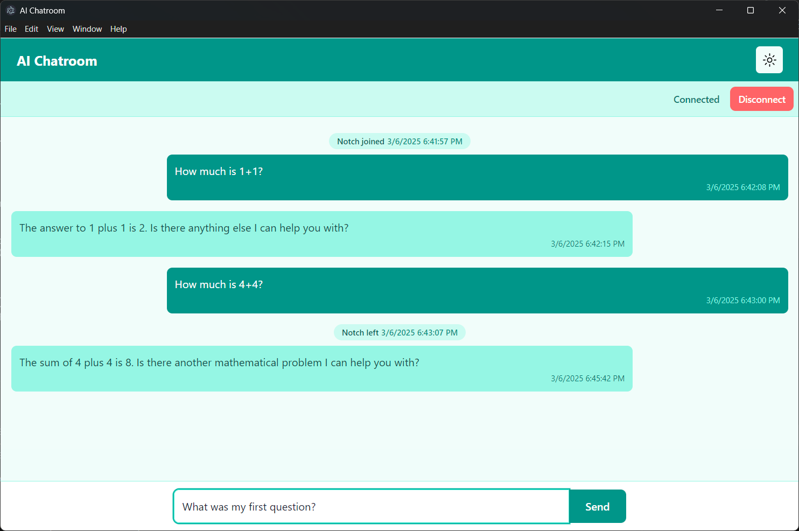
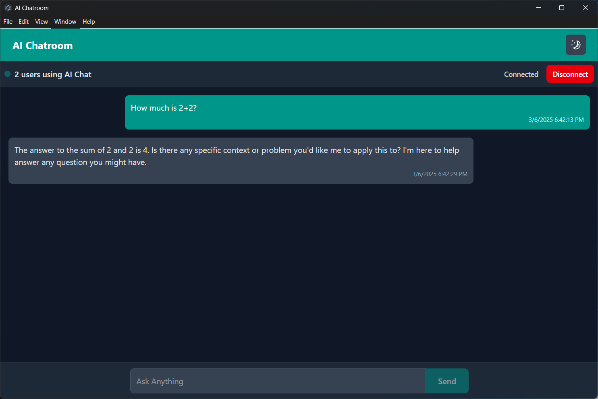
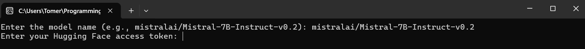
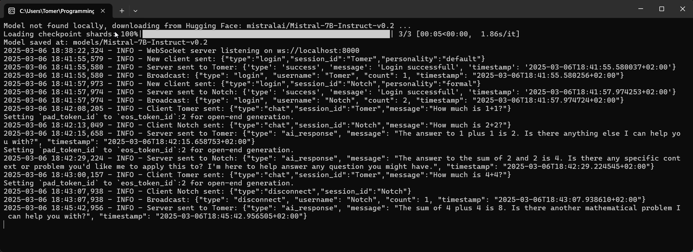

# AI Chatrooom

AI Chatroom is an AI-powered real-time chatroom application with support for multiple AI personalities, powered by a Python websockets server and a Vite-based React frontend.  
Supports downloading and changing models using [Hugging Face](https://huggingface.co/models).

## Features

- **Login Page:**

  - **Username and Port** - Supports username input and server port selection.
  - **Multiple AI personalities** - Select different AI personas.

  

- **Real-Time AI Chat:**

  - **Conversation history** - AI adapts to previous messages in the session.
  - **User count & Alerts** - Displays number of connected users and alerts on user login/disconnect.
  - **Dark/Light mode**

  
  

- **Websocket Server**:

  - **Custom AI models** - Choose from different AI models by entering their name ([Hugging Face](https://huggingface.co/models) format).  
    \* For gated models enter access token, otherwise leave empty  
    \*\* Models are downloaded locally for quick successive launches.
    

  - **Server Logs** - The Server logs all user interactions in terminal and into File [(docs/example-logs)](example-logs.txt).
    

## Prerequisites

- Python 3.10 or above
- Npm
- Node.js

## Getting Started

## Backend (Python websockets)

### Running locally

1. Navigate to the backend directory
   ```pwsh
   cd backend
   ```
2. Install dependencies
   ```pwsh
   pip install -r requirements.txt
   ```
3. Run the backend server
   ```pwsh
   python main.py
   ```
4. Enter model name, optional access token and server port.
   All environment variables can be defined in a `.env` file, using `command-line arguments` or by manual input when prompted.

### Building Executable

(Takes a few minutes)

1.  Navigate to the backend directory

    ```pwsh
    cd backend
    ```

2.  Obfuscate with `pyarmor`

    ```pwsh
    pyarmor gen -O dist -r config logs models utils workers main.py
    ```

3.  Navigate to the dist directory

    ```pwsh
    cd dist
    ```

4.  Package with pyinstaller  
    ```pwsh
     pyinstaller --name server --hidden-import=asyncio --hidden-import=websockets --hidden-import=dotenv --hidden-import=transformers --hidden-import=pytz --add-data config/*.py:config --add-data logs/*.py:logs --add-data models/*.py:models --add-data utils/*.py:utils --add-data workers/*.py:workers main.py
    ```
    *(`--onefile` flag works too but due to the very big transformers library the exe becomes over 2GB)  
    The `server.exe` will be available under `backend/dist/dist`.

## Frontend (Vite + React)

### Running Locally

1. Navigate to the frontend directory

   ```pwsh
   cd frontend
   ```

2. Install dependencies

   ```pwsh
   npm install
   ```

3. Run the Frontend

   ```pwsh
   npm run dev
   ```

The Application will become available at `localhost:3000`

### Building Executable

(Takes around a minute)

1. Build the frontend and obfuscate with `javascript-obfuscator`

   ```pwsh
   npm run build
   ```

2. Package with Electron
   ```pwsh
   npm run package
   ```
   The packaged application will be located under `frontend/release-builds`
